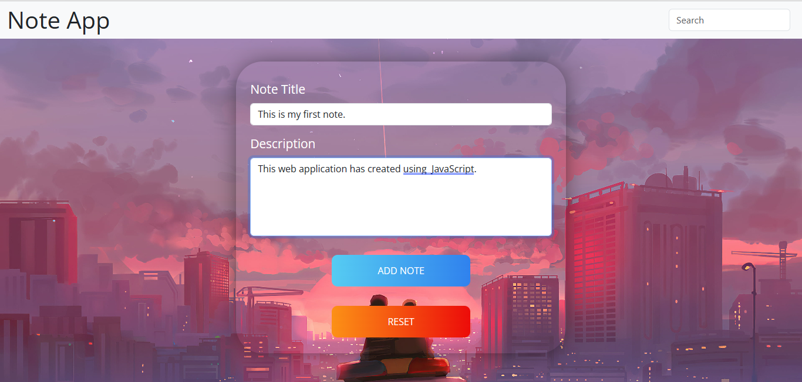
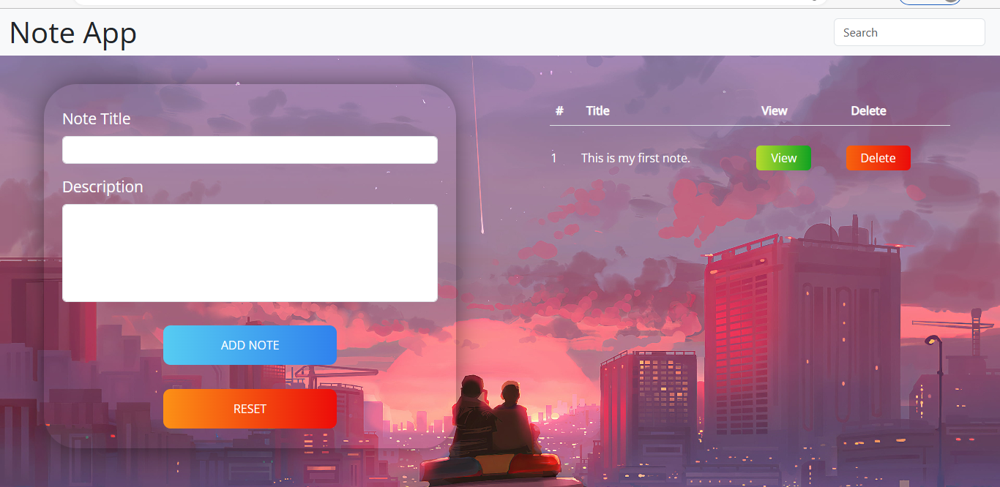
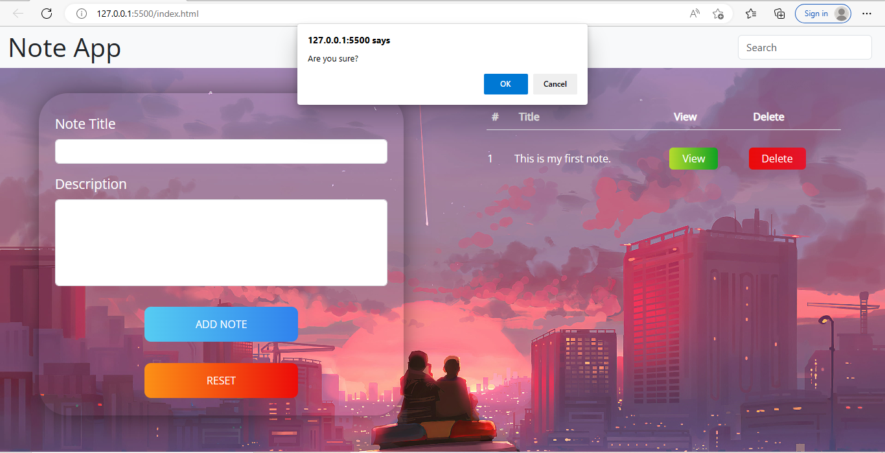

# Note App - Javascript

In this simple note taking project I have used  some of the more intermediate advanced parts of the document object model or the javascript dom to show  how to build this web application. Users can add their notes and all those notes are displaying in a separate table. From that table user can update or delete the each notes. Also user can search any from note list. There is search bar in the top, when user searching a word only the relevant and similar note title will appear from the table and others will not display.

## Screenshots

 
